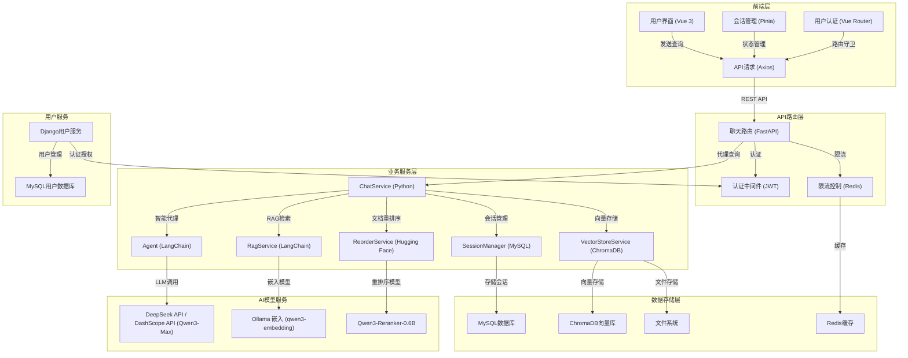

# 🚀 RAG对话系统

<div align="center">
<a href="https://github.com/RMA-MUN/LangChain-RAG-FastAPI-Service/stargazers">
  
</a>
<a href="https://github.com/RMA-MUN/LangChain-RAG-FastAPI-Service/network/members">
  
</a>
  
</div>

## 📋 目录

- [项目简介](#项目简介)
- [核心特性](#核心特性)
- [项目架构](#项目架构)
- [项目演示](#项目演示)
- [快速开始](#快速开始)
- [技术栈](#技术栈)
- [项目结构](#项目结构)
- [API 文档](#api文档)
- [配置说明](#配置说明)
- [部署指南](#部署指南)
- [开发指南](#开发指南)
- [故障排除](#故障排除)
- [文档](#文档)
- [联系方式](#联系方式)

## 项目简介

基于 **FastAPI + LangChain** 构建的企业级智能对话系统，集成先进的 **RAG（检索增强生成）** 技术，能够基于文档内容提供高精度的智能问答服务。系统采用微服务架构，具备会话持久化、多语言支持和模块化设计等特性。

## 核心特性

- **智能问答** 💬：基于 RAG 技术，结合文档检索和大语言模型，提供精准的问答体验
- **会话持久化** 💾：使用 MySQL 存储会话历史，支持长期保存和回溯
- **多语言支持** 🌐：前端集成 i18n，支持中英文界面切换
- **文档管理** 📄：前端可视化文档上传、管理(查看细致的切片、原文档等信息)
- **安全性** ⛑️：对不同用户的知识库进行隔离，RAG检索只能检索到自己上传的文档
- **微服务架构** 🏗️：分离的用户服务和对话服务，易于扩展和维护
- **高性能** ⚡：基于 FastAPI 和 ChromaDB，提供卓越的性能表现

## 项目架构



## 项目演示

### 主要功能界面

| 功能模块 | 界面展示 | 功能说明 |
|---------|:--------|---------|
| AI 聊天 |  | 基于 RAG 的智能问答界面，支持上下文对话和文档引用 |
| 聊天管理 |  | 会话历史管理，支持会话列表查看和切换 |
| 用户服务 |  | 用户注册、登录和个人信息管理 |
| 知识库管理 |  | 文档上传、查看和管理知识库 |
| 文档切片 |  | 可视化文档切片详情，支持查看切片内容 |

> **提示**：点击图片可查看大图，所有界面均支持中英文切换

## 快速开始

### 环境要求

| 环境 | 版本推荐 |
|------|----------|
| Python | 3.12+ |
| uv | 0.11.9   |
| Node.js | 16+ |

### 克隆项目

```bash
git clone https://github.com/RMA-MUN/LangChain-RAG-FastAPI-Service.git
cd LangChain-RAG-FastAPI-Service
```

### 安装依赖

#### 后端依赖
```bash
cd backend
uv venv
uv sync
```

#### 前端依赖
```bash
cd front
npm install
# 或使用 pnpm
pnpm install
```

### 环境配置

#### 创建后端环境变量文件

在 `backend` 目录下创建 `.env` 文件，参考 `.env.example` 文件填写配置：

```env
# ==================== LLM 大模型配置 ====================
# LLM类型：ALIYUN | OLLAMA | DEEPSEEK
LLM_TYPE=DEEPSEEK

# ==================== DeepSeek 配置 (LLM_TYPE=DEEPSEEK) ====================
DEEPSEEK_API_KEY=your_deepseek_api_key
DEEPSEEK_BASE_URL=https://api.deepseek.com/v1
DEEPSEEK_MODEL_NAME=deepseek-chat

# ==================== Ollama 配置 (LLM_TYPE=OLLAMA) ====================
OLLAMA_BASE_URL=http://localhost:11434
OLLAMA_MODEL_NAME=qwen3.5:0.8b

# ==================== 阿里云百炼配置 (LLM_TYPE=ALIYUN) ====================
ALIYUN_ACCESS_KEY_SECRET=your_api_key
ALIYUN_BASE_URL=https://dashscope.aliyuncs.com/compatible-mode/v1
CHAT_MODEL_NAME=qwen3-max

# ==================== 向量嵌入模型配置 ====================
EMBED_MODEL_TYPE=OLLAMA
TEXT_EMBEDDING_MODEL_NAME=qwen3-embedding:0.6b
ALIYUN_EMBED_MODEL_NAME=qwen3-embedding

# ==================== 数据库配置 ====================
MYSQL_USER=root
MYSQL_PASSWORD=123
MYSQL_HOST=localhost
MYSQL_PORT=3306
MYSQL_DATABASE=chat_history

REDIS_HOST=localhost
REDIS_PORT=6379
REDIS_DB=0

# ==================== 服务配置 ====================
DJANGO_API_URL=http://127.0.0.1:8001

# ==================== LangSmith 调试追踪 ====================
LANGCHAIN_TRACING_V2=true
LANGCHAIN_API_KEY=your_langsmith_api_key
LANGCHAIN_PROJECT=my-fastapi-langchain-project

# ==================== 重排序模型配置 ====================
RERANKER_MODEL_PATH=D:\Hugging_Face\models\Qwen3-Reranker-0.6B

# ==================== JWT 身份验证配置 ====================
SECRET_KEY=MY_JWT_SECRET_KEY
ALGORITHM=HS256
```

#### 创建用户服务环境变量文件

在 `DjangoUserService` 目录下创建 `.env` 文件：

```env
# JWT 配置
JWT_SECRET_KEY=YOUR_JWT_SECRET_KEY

# 数据库配置
DB_PORT=3306
DB_NAME=user_service
DB_USER=root
DB_PASSWORD=root
DB_HOST=localhost

# Celery 配置
CELERY_BROKER_URL=redis://localhost:6379/0
CELERY_RESULT_BACKEND=redis://localhost:6379/0
CELERY_TASK_TIME_LIMIT=300
CELERY_TASK_SOFT_TIME_LIMIT=250
CELERY_RESULT_EXPIRES=3600

# Redis 配置
REDIS_CACHE_URL=redis://localhost:6379/1
```

配置好env文件后，我们需要执行Django ORM的迁移命令来迁移数据库表：

```bash
python manage.py makemigrations
python manage.py migrate
```


### 向量数据库配置

修改 `backend/app/config/chroma.yaml` 文件：

```yaml
collection_name: rag_collection
persist_directory: data/chromadb
k: 3

data_path: data
md5_hex_store: data/md5_hex_store/md5_hex_store.txt
allow_knowledge_file_types: ["txt", "pdf"]

chunk_size: 200
chunk_overlap: 20
separators: ["\n\n", "\n", "。", "！", "？", "!", "?", " ", ""]
```

### 启动服务

| 服务 | 命令 | 端口 |
|------|------|------|
| 后端服务 | `cd backend && uvicorn main:app --reload` | 8000 |
| 前端服务 | `cd front && npm run dev` | 3000 |
| 用户服务 | `cd DjangoUserService && uv run python manage.py runserver 8001` | 8001 |
| MySQL | `net start mysql` | 3306 |
| Redis | `redis-server` 或 `net start redis` | 6379 |
| Ollama | `ollama serve` | 11434 |

## 技术栈

### 后端技术

| 技术 | 说明 |
|------|------|
| FastAPI | 高性能异步 Web 框架 |
| LangChain | 大语言模型应用开发框架 |
| ChromaDB | 轻量级向量数据库 |
| Django | 用户认证和管理系统 |
| MySQL | 关系型数据库 |
| Redis | 缓存数据库 |
| DeepSeek API / DashScope API | 大语言模型服务 |
| Hugging Face | 预训练模型服务 |
| PyTorch | 深度学习框架 |
| Sentence-Transformers | 句子嵌入库 |

### 前端技术

| 技术 | 说明 |
|------|------|
| Vue 3 | 现代化前端框架 |
| Vite | 极速构建工具 |
| Vue Router | 路由管理 |
| Pinia | 状态管理 |
| i18n | 国际化支持 |

## 项目结构

```
├── backend/                  # FastAPI 后端服务
│   ├── app/                  # 应用代码
│   │   ├── agent/            # 智能代理模块
│   │   ├── config/           # 配置文件目录
│   │   ├── model/            # 数据模型定义
│   │   ├── prompt/           # 提示词模板
│   │   ├── rag/              # RAG 核心功能
│   │   ├── router/           # API 路由定义
│   │   ├── services/         # 业务服务层
│   │   └── utils/            # 工具函数
│   ├── data/                 # 数据存储目录
│   ├── main.py               # 应用入口文件
│   └── requirements.txt      # 后端依赖列表
├── front/                    # Vue 前端项目
│   ├── src/                  # 源代码
│   ├── public/               # 静态资源
│   └── package.json          # 前端依赖配置
├── DjangoUserService/        # Django 用户服务
└── README.md                 # 项目说明文档
```

## API文档

### FastAPI 后端 API

- **[API 规范](./backend/openapi.json)**：后端 OpenAPI 规范文件
- **[交互式文档](http://localhost:8000/docs)**：启动服务后访问自动生成的交互式文档

### Django 用户服务 API

- **[API 文档](./DjangoUserService/api.md)**：详细的用户服务 API 文档
- **[交互式文档](http://localhost:8001/api/)**：启动服务后访问用户服务 API 文档

## 开发指南

### 代码结构说明

- `backend/app/rag/`：RAG 核心功能，包括向量存储和检索
- `backend/app/agent/`：智能代理，处理用户请求和对话逻辑
- `backend/app/services/`：业务服务层，提供会话管理等功能
- `backend/app/utils/`：工具函数，包括配置加载、文件处理等
- `front/src/views/`：前端页面组件
- `front/src/components/`：可复用的前端组件

### 开发流程

1. **添加新功能**
   - 在对应的模块中添加代码
   - 运行测试确保功能正常
   - 更新相关文档

2. **调试技巧**
   - 使用 FastAPI 的自动重载功能：`uvicorn main:app --reload`
   - 使用 Vue 的热更新功能：`npm run dev`

## 故障排除

详细的故障排除指南请参考：[故障排除](./docs/troubleshooting.md)

## 文档

项目文档位于 `docs/` 目录：

- **[ModelScope 模型配置](./docs/modelscope_model.md)**：详细的模型下载和配置说明
- **[故障排除](./docs/troubleshooting.md)**：常见问题和解决方案
- **[API 文档](./backend/openapi.json)**：后端 API 接口文档
- **[用户服务 API](./DjangoUserService/api.md)**：用户服务 API 文档

## Star History

<picture>
  <source media="(prefers-color-scheme: dark)" srcset="https://api.star-history.com/chart?repos=RMA-MUN/LangChain-RAG-FastAPI-Service&type=date&theme=dark&legend=top-left" />
  <source media="(prefers-color-scheme: light)" srcset="https://api.star-history.com/chart?repos=RMA-MUN/LangChain-RAG-FastAPI-Service&type=date&legend=top-left" />
  
</picture>

## 联系方式

如有任何问题或建议，欢迎在 GitHub 提交 issues 或联系作者：

- Email: n3032747608@163.com
- QQ: 3032747608